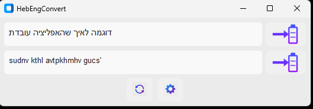

# HebEngConvert

HebEngConvert is a modern, lightweight Windows utility designed to instantly convert text between Hebrew and English keyboard layouts. Whether you've accidentally typed a sentence in the wrong language or need to quickly fix clipboard content, this tool provides a seamless one-click solution.

> [!NOTE]
> This application was created entirely using **AI** (Antigravity by Google DeepMind), demonstrating advanced agentic coding and UI design capabilities.

## Features

- **Tray-Based Utility**: Runs quietly in your system tray with a custom clipboard icon.
- **Global Hotkey**: Instantly open and refresh the converter window with a customizable shortcut (default: `CTRL+ALT+D`).
- **One-Click Conversion**: 
    - Top section: English text to Hebrew layout.
    - Bottom section: Hebrew text to English layout.
- **Micro-Refresh**: Quickly update the window content with your current clipboard.
- **Sleek, Modern UI**: Built with `customtkinter`, featuring a high-contrast dark theme and vibrant blue/purple gradients.
- **Single Instance Support**: Ensures only one copy of the app runs at a time (configurable via settings).

## Screenshot

## How to Use

1. **Launch**: Run `HebEngConvert.exe`. You'll see a notification in the Windows Action Center and a purple clipboard icon in your tray.
2. **Convert**: Simply copy any text to your clipboard and hit your global hotkey (Default: `CTRL+ALT+D`).
3. **Copy Back**: Click the large purple clipboard icon next to the converted text to copy it back to your clipboard instantly.
4. **Refresh**: Use the circular arrow icon in the bottom control row to pull the latest clipboard content manually.

## Settings & Configuration

Click the **Gear Icon** in the application window to open the settings dialog:

- **Hotkey Customization**:
    1. Click the "Capture" button.
    2. Press your desired key combination (e.g., `Ctrl+Shift+H`).
    3. The application will record and format it automatically.
    4. Click "Save Settings" to apply instantly.
- **Instance Port**:
    - **Single Instance Check**: If enabled, the app uses a local communication port (default: `54321`) to ensure only one window is open. If you run the app a second time, it will simply refocus the existing one.
    - **Port Number**: You can change this port if it conflicts with other software on your machine.
- **Persistence**: All settings are automatically saved to `.hebengconvert.json` in your user home directory.

## Privacy & Security

**100% Local & Private**
- ✅ **No telemetry or analytics** - Zero network calls, no data collection
- ✅ **Fully offline** - No internet connection required
- ✅ **Open source** - All code is transparent and reviewable on GitHub

**What the app accesses:**
- 📋 **Clipboard** - Reads clipboard content when you open the window or press refresh
- ⌨️ **Keyboard** - Listens for your custom global hotkey (default: Ctrl+Alt+D)
- 💾 **Local storage** - Saves settings to `~/.hebengconvert.json` (hotkey, port, preferences)
- 🖥️ **System tray** - Displays a tray icon for quick access

**No access to:**
- ❌ Network/Internet
- ❌ File system (beyond its own config file)
- ❌ Other applications
- ❌ System processes

## Requirements

- **OS**: Windows 10/11
- **Standalone**: No installation required. Fully portable executable.

## Disclaimer

This software is provided "as is", without warranty of any kind, express or implied. By using this application, you agree that the author and AI creators are not responsible for any issues, data loss, or system conflicts that may arise. Always ensure the Hotkey and Instance Port do not conflict with other critical software on your machine.

---
*Created by Antigravity AI.*
